# Sample-Quiz-1

# 1

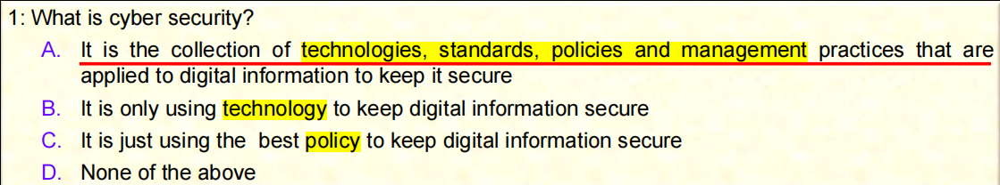

A

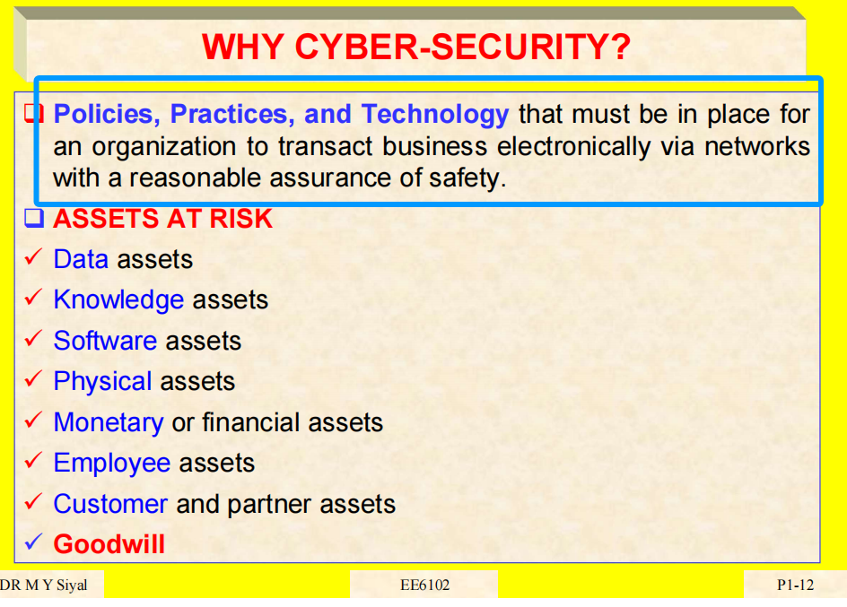

# 2

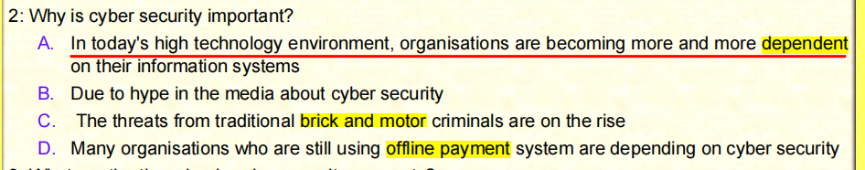

B

hype 大肆的宣传广告，炒作；（为做广告而进行的）欺骗；<非正式>皮下注射针，皮下注射；<非正式>有毒瘾者

C

- **Brick（砖）** 和 **Mortar（灰浆、砂浆）**
- 这是构成传统建筑物的两种基础材料。

所以，“**brick and mortar**” 从字面上讲，就是用砖和灰浆建成的建筑，也就是“**真实存在的建筑物**”。

# 3

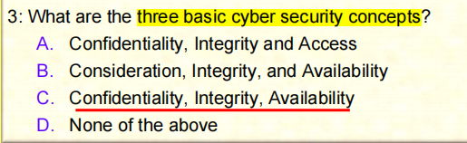

C

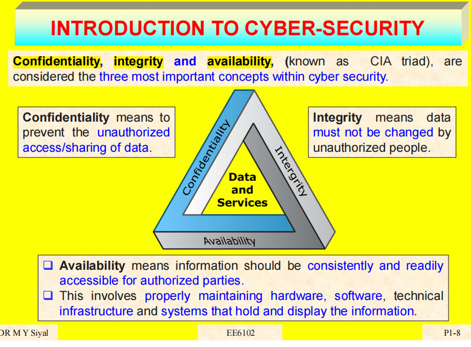

# 4

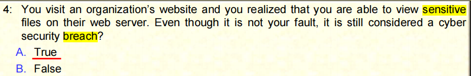

Q

breach 漏洞

# 5

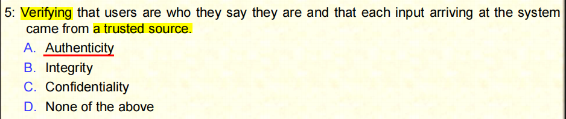

A

Authenticity 真实性，可靠性

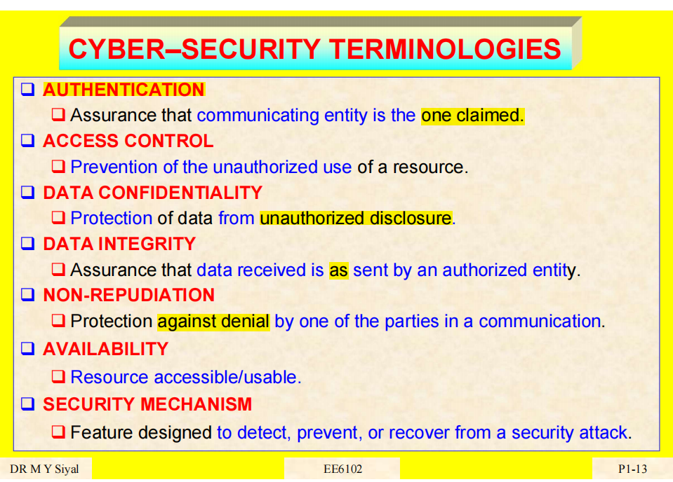

# 6

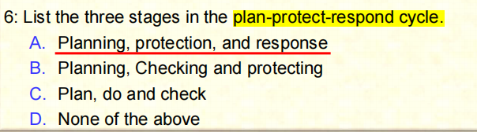

# 7

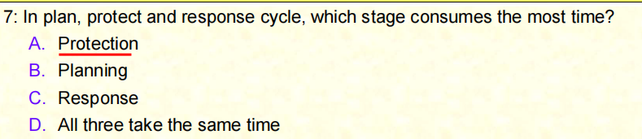

# 8

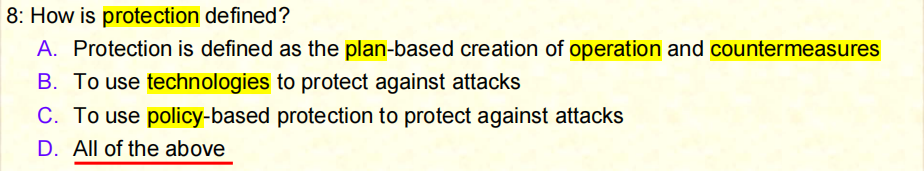

# 9

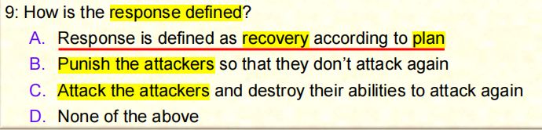

# 10

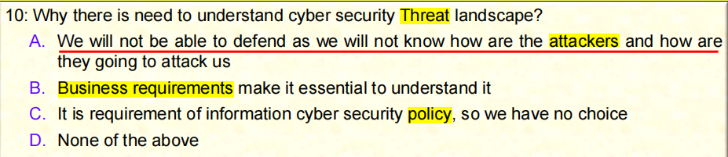

# 11

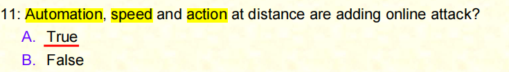

# 12

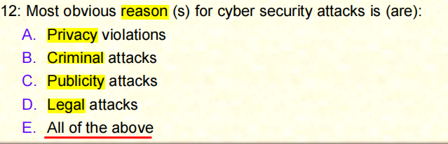

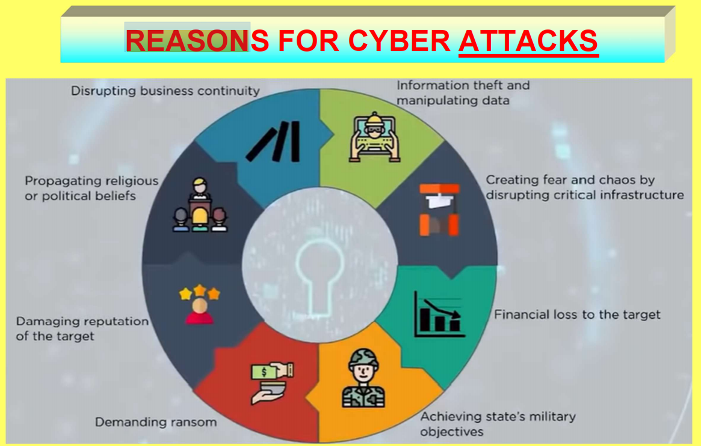

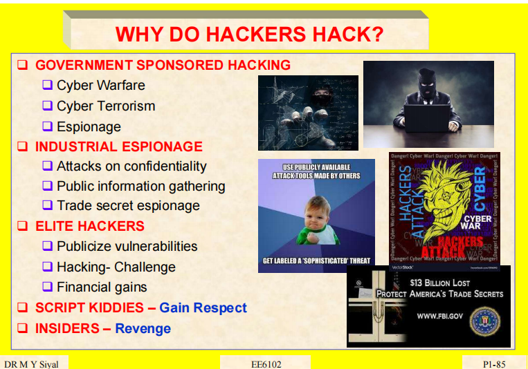

# 13

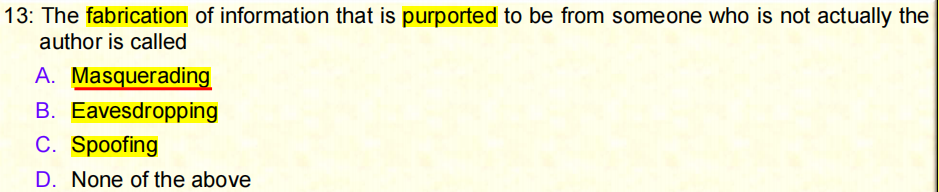

fabrication 伪造信息

purported 声称（purport 的过去分词）；意图

A

Masquerading 伪装；冒充

B

Eavesdropping 偷听；窃取

C

Spoofing 电子欺骗

# 14

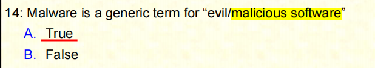

A

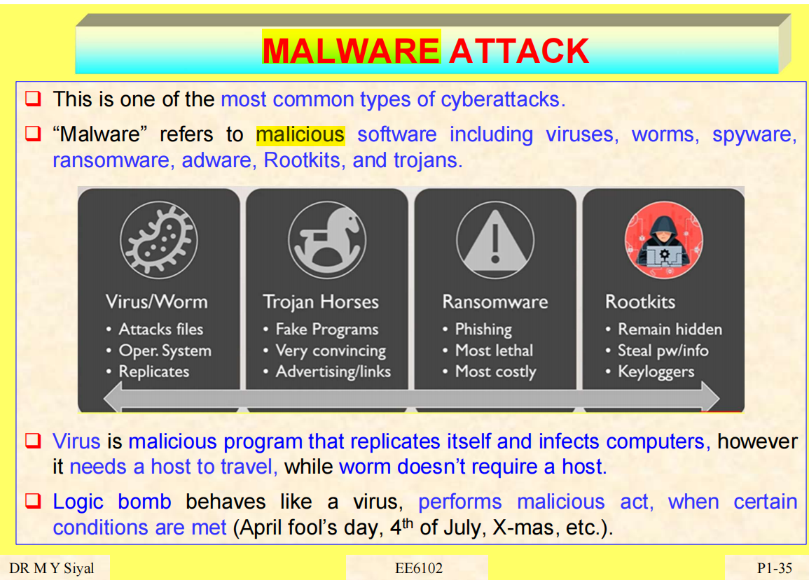

# 15

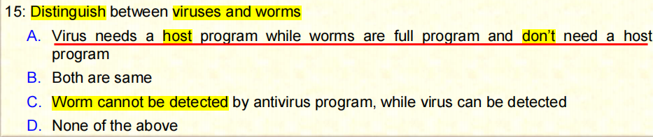

A

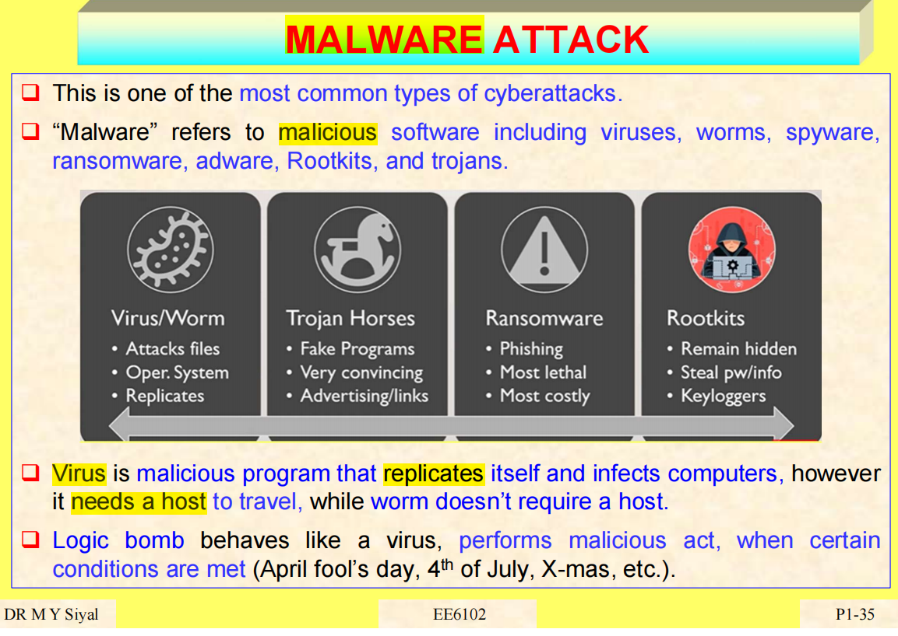

# 16

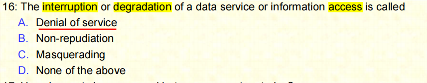

A

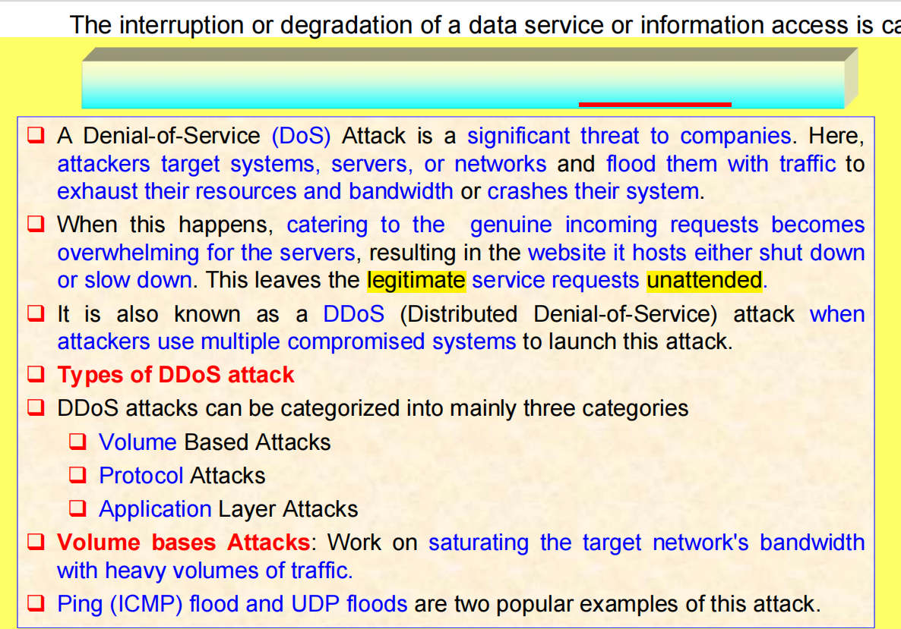

B

repudiation否认，拒绝；抛弃，断绝关系

# 17

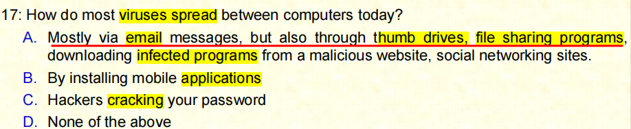

# 18

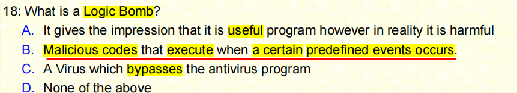

# 19

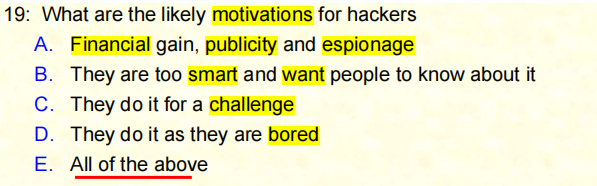

A

espionage 间谍行为，谍报活动

# 20

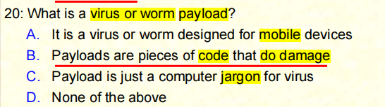

Q

payload（导弹、火箭等的）有效载荷，有效负荷；收费载重，酬载；（工厂、企业等）工资负担

C

jargon 行话，黑话；烟色红皓石，黄皓石

# 21

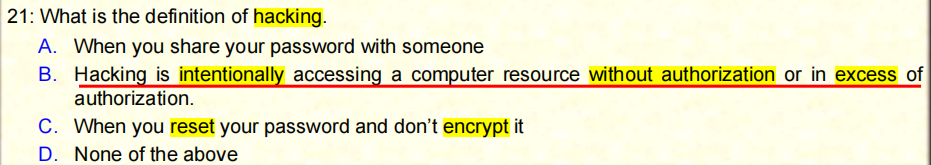

B

intentionally 故意地，有意地

excess 超过，过量；越轨行为，暴行；无节制，无度；（保险中的）免赔额

# 22

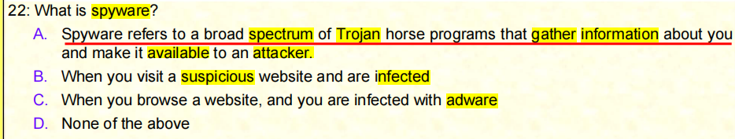

Q

spyware 间谍软件；后门程式

A

spectrum 范围，幅度；光谱；波谱，频谱；余象

Trojan 特洛伊木马：一种恶意软件，通过伪装成有用的程序来诱使用户安装，从而在用户的计算机上执行恶意操作

# 23

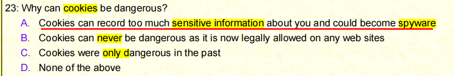

# 24

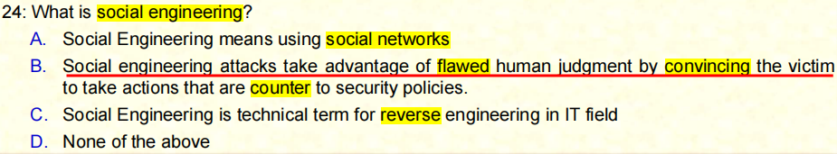

# 25

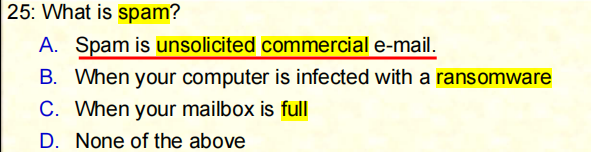

**A**

spam 垃圾电邮；（斯帕姆）午餐肉（Spam）

unsolicited 未经请求的；主动提供的

commercial 商业的，商务的；商业化的，以获利为目的的；由广告商支付的；（化学制品）大量供应且纯度不高的

# 26

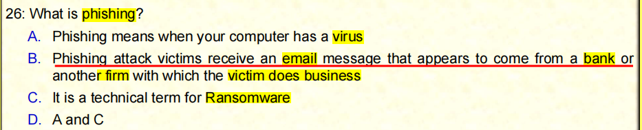

phishing网络钓鱼

Ransomware勒索软件

# 27

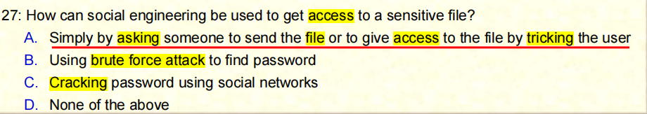

