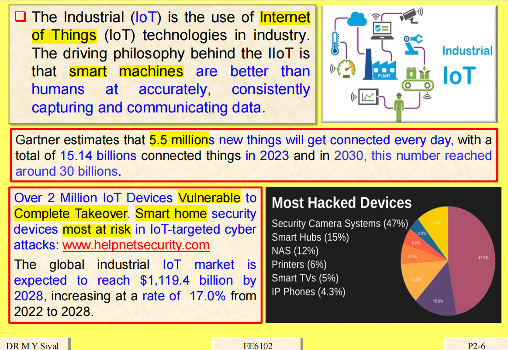

# Sample-Quiz 2

# 1

D

German

# 2

**D**

encompasses 包含，包括；包围，环绕（encompass 的第三人称单数）

# 3

**B**

# 4

**C**

# 5

# 6

compromised 妥协的，妥协让步的；缺乏抵抗力的

# 7

Malicious 恶意软件（malware）这个词来自于恶意的（malicious）和软件（software）的组合，计算机专家用这个词来意指多种敌意..

Unintentional 非故意的；无意识的

# 8

omissions 省略、遗漏

disgruntled 不满的；不高兴的

# 9

deterrent 威慑，遏制；威慑武器

liable （在法律上）有责任的，有义务的；负有偿付责任的；很可能会发生的；有……倾向的

# 10

# 11

# 12

# 13

# 14

# 15

# 16

vishing 话钓 （一种网络电话诈骗形式）

spoof 滑稽模仿；行骗；戏弄；讽刺性文章或节目

# 17

compliance 合规性：服从，遵守；屈从，迁就；可塑性，柔量

合规性应该是a

合规性可能会使网络安全对攻击者来说很困难，但是对于用户来说并不是

# 18

interpret 解释，说明；口译；把……理解为；演绎

breaches 违反，破坏（breach 的复数）

# 19

# 20

