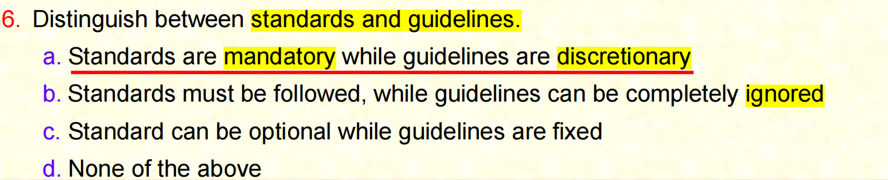

# Sample-Quiz 3

# 1

A

让我们来看看它应该购买最先进的技术，你不能只是盲目地去购买技术，不管你是否需要它，技术本身并不意味着它会为你提供安全性，

B

所以你应该做的第一件事就是评估你目前的状态是什么，为什么它不起作用，缺少什么，如果你需要技术，那么你就去购买，如果你需要政策，你就去设计它，所以我们需要看看当前状态是什么，为什么不起作用，而不是你不假思索地去购买新技术，这就是我们需要计划的意思，我们需要在购买新技术之前看看我们现在在哪里，花很多钱购买新技术

# 2

B

我们之前讨论过的，如果没有高层管理人员的支持，我们就无法实施网络安全，所以我们肯定需要支持，但不仅仅是在开始时，我们需要从始至终的支持，在我们实施时，当我们执行时，如果管理层只在开始时提供支持，而他们却忘了这一点，那么项目就会失败

# 3

他们提供适当的预算，自己遵守规则和规定，然后员工就会遵守，因为如果老板在做某事，那么每个人都必须这样做，所以 a 是正确的 

B 发送电子邮件给员工，我会让员工通知他们，他们支持该项目，如果他们只是发送电子邮件，之后他们就忘了这是行不通的，管理层无能为力，因为它是由技术人员管理的，当然不是，是的，我们需要技术，我们需要政策，但该项目必须得到高层管理人员的支持，所以唯一正确的答案是发送电子邮件，他们支持项目他们什么也不做，当然不是，我们需要提供资金，他们必须自己遵守政策，然后只有其他人会遵守，

# 4

A

什么是政策，政策是关于在何种情况下应该做什么的声明 具体情况 那是正确的 

B

政策 描述为实施政策指导而采取的行动那不是正确的，那是政策的执行，我们正在研究的政策唯一正确的陈述是A

政策是告诉我们在什么条件下应该做什么的陈述

# 5

为什么政策需要被用户接受 如果政策不可接受 那么用户就会绕过它 这是危险的 那是正确的 因为我们会认为我们有政策 每个人都在遵守但是因为它们不可接受，人们会绕过它 所以接受者也可以绕过它 这样用户就可以根据自己的需要进行修改 用户不能为每个人修改政策当有政策时 它适用于每个人 你不能修改 所以唯一正确的答案是A

# 6

mandatory 强制性的，义务的；受（前国际联盟）委任统治的

discretionary 自由决定的，酌情决定的；代表委托人全权进行投资的

区分标准和指南 记住标准是必须的 指南是可选的但必须仔细考虑 所以标准是强制性的 这是正确的 但是指南是自由裁量的 那是正确的必须遵循标准 虽然指南可以完全被忽略 我们不能忽略指南 我们必须仔细考虑它们所以 B 是错误的 标准可以是可选的 这是错误的 所以唯一正确的答案是A。标准不是可选的标准是必须的，政策是可选的 但必须考虑 我们不能只说它们是可选的 我们不需要担心 关于它，他们必须仔细考虑，如果它们实用，我们需要你，我们实施它们，如果它们不是，那么我们不需要实施

# 7

对于指导方针，什么是强制性的，决策者必须仔细考虑，不，这是正确的，对于指导方针，没有什么是强制性的，这是不正确的，因为必须仔细考虑指导方针，因为指导方针是必须的，一切都是强制性的，指导方针不是必须的，所以只有正确的答案是A。标准是必须的，指导方针是可选的，但我们必须仔细考虑它们

# 8

以下哪一项不是身份验证因素，是的，不是你拥有的东西，是你知道的东西，是你看到的东西，不是你是的东西，所以正确的答案是C，因为在这里看的不是你能看到的东西，你无法被它识别，无论你看到的是鸟、水、花园还是其他什么，它都与你的身份验证无关，你拥有的东西是独一无二的，你知道的东西是独一无二的，你是独一无二的，所以你可以被识别，但在这里我们看的不是

# 9

Authorizations 授权；授权书（authorization 的复数）

Authentication 证明真实性，鉴定；身份验证，认证

评估每个声称有权使用资源的个人身份的过程 授权 没有，身份验证 是的 我们必须先对人们进行身份验证 才能授权他们 所以这就是评估身份的过程 称为身份验证 因此我们会对人们进行身份验证，一旦他们通过了身份验证 我们就会根据他们的角色授权他们访问资源 

# 10

简短而简单 可重复使用的密码总是很容易被黑客纠正 简短而简单 是的 他们很容易被破解 不管它是简单的还是复杂的 没有密码可以很容易地纠正 简单的密码可以很容易地纠正 复杂的密码可以正确但不容易。

因为它们简单且可重复使用简单而简短 所以很容易被破解 

# 11

使用生物识别技术可以增强客户信任 没错 这就是我们使用生物识别的原因 当我们使用生物识别时 我们认为我们在与真人打交道 因为他们使用他们的脸和指纹 他们的人 当他们使用密码时 我们不信任他们 他们可能是代理人 软件代理可以是机器，所以这就是为什么研究开始研究基于生物特征的身份验证的原因之一，因为他们做了研究，发现人们更信任人，当你去餐馆吃饭时，当你想付账时，服务员拿着账单过来，你把信用卡交给服务员，你不会认为服务员会拍下你的信用卡，他们会滥用它，这是有可能的，对吧，但我们不这么认为，因为我们是在和人打交道，所以我们信任他们，但是当我们上网买东西时，我们输入信用卡信息，我们担心，也许攻击者会得到这些信息，他们可能会使用它，因为我们看不到人，我们在和机器打交道，所以这就是为什么研究开始研究生物特征，因为生物特征可以增强信任，这就是为什么每个人都关注基于生物特征的身份验证，这样我们就可以摆脱密码

# 12

当今最常用的生物特征识别设备是什么，测谎仪，它们不是基于生物特征的设备，长而复杂的密码也不是生物特征识别的指纹是的，视网膜扫描仪是，但最常见的指纹。视网膜扫描仪是生物识别技术，但它们并不常用。

# 13

当一个人与模板不匹配时，就会发生错误接受。这是真的，这被称为错误接受。某人被错误地接受了，应该被拒绝，但被错误地接受了。

# 14

deception 欺骗

当接受者故意试图欺骗系统时，这被称为不是错误接受，而是错误拒绝，因为现在是故意的，这被称为欺骗。

# 15

deceived 欺骗；误导；对（固定性伴侣）不忠（deceive 的过去式和过去分词）

下列哪项陈述准确地描述了指纹识别？准确地描述了指纹识别扫描仪非常昂贵，这并不准确，因为它们很便宜。指纹识别很容易被欺骗，这是准确的。指纹识别很少使用，这也不准确，所以只有准确的是B

