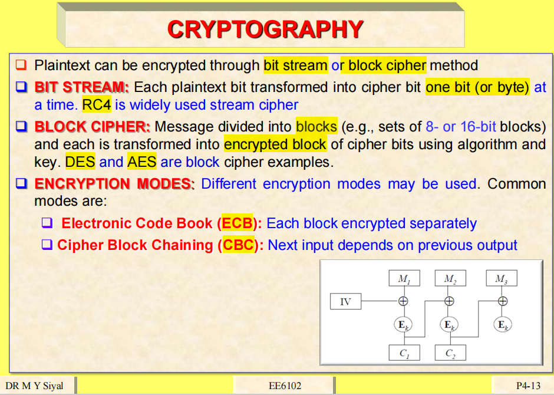
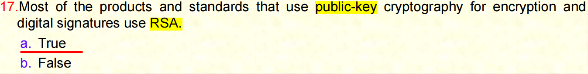
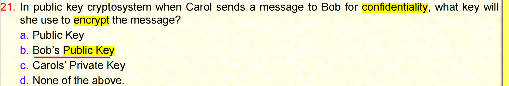
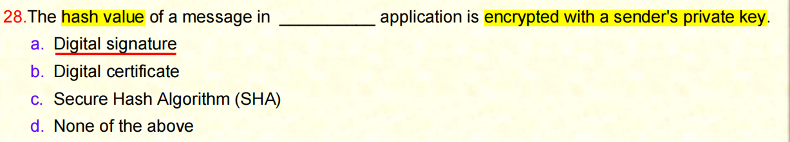

# Sample-Quiz 4

# 1

将**明文**（plaintext）转换为**密文**（ciphertext）的过程称为**加密**（encryption），而不是解密。题目中说这个过程被称为解密（deciphering），这是错误的。

**解密**（decryption）是将密文转换回明文的过程。因此，"从明文到密文" 是加密，不是解密，这就是为什么选项 a 是错误的原因。

# 2

“crypto”表示“秘密”或“加密”；“cryptography”是“密码学”，“cryptocurrency”则是“加密货币”。

如果**发送者和接收者使用相同的密钥**来进行加密和解密，那么这种加密系统被称为**对称加密系统**（Symmetric Key Crypto System）。

**对称加密**的特点是发送方和接收方使用相同的密钥，因此称为“对称”。

而**非对称加密**（Asymmetric Encryption）则使用**一对密钥**，一个是公开的“公钥”（Public Key），另一个是保密的“私钥”（Private Key）。这种加密方式才属于“公钥密码系统”（Public-Key Crypto System）。

因此，题目中所描述的情况是对称加密系统，对应选项 **C. Symmetric key crypto system**，是正确答案。

# 3

当消息被分成块（例如 8 位或 16 位）时，如果每个块都使用加密算法和密钥进行加密，这种方式被称为**块密码**（Block Cipher）。

如果是按位（bit）加密的，则称为**流密码**（Bit Stream Cipher）。

当我们使用**块加密**时，我们是对一整个数据块进行加密和解密；而**流加密**则是一位一位或一字节一字节地加密数据。

本题描述的是将消息按块分割，并逐块加密，因此正确答案是 **a. Block Cipher**。

例如：

- DES 是一种块密码，块大小为 64 位；
- AES 也是块密码，块大小为 128 位。

因此，这种加密方式的关键点在于：**按块处理数据并加密**，这正是块加密的定义。

# 4

本题问的是：以下哪个是**使用 64 位分组的对称加密系统**？

首先我们要理解：

- **对称加密（Symmetric Encryption）** 是指加密和解密使用**相同的密钥**。
- **非对称加密（Asymmetric Encryption）** 则使用一对密钥：公钥和私钥，例如 **RSA**。

因此，**RSA** 属于非对称加密，不符合题意。

再看 **DES（Data Encryption Standard）**：

- DES 是一种对称加密算法；
- 它使用固定大小的 **64 位数据块** 进行加密。

所以，**DES 同时满足“对称加密”和“64-bit blocks”** 这两个条件，正确答案是： **b. DES**

# 5

**问题：DES 系统使用多大的密钥？**

我们在课堂上已经多次讨论过，**DES（Data Encryption Standard）使用的是 56 位密钥**。虽然其输入密钥是 **64 位**，但其中有 **8 位**是用于奇偶校验的，因此实际参与加密过程的密钥长度是 **56 位**。

各个选项解释如下：

- **a. 64 bit** ❌
   这个是常见误区。虽然 DES 输入的是 64 位密钥，但其中只有 56 位是真正用于加密的，剩下的 8 位用于奇偶校验。
- **b. 128 bit** ❌
   128 位密钥通常用于 AES（高级加密标准），而不是 DES。
- **c. 56 bit** ✅
   正确答案。DES 的有效密钥长度为 56 位。
- **d. 256 bit** ❌
   256 位密钥通常用于 AES-256 或其他现代加密算法，不属于 DES。

# 6

**问题：DES（数据加密标准）是什么类型的加密算法？**

DES 是一种**块密码（Block Cipher）**。它将明文数据分成 **64 位的固定大小的块**，每次对一个数据块进行加密或解密。

这与**流密码（Stream Cipher）**不同，流密码是按位或按字节连续加密的。

每种加密方式的特点如下：

- **a. Block cipher** ✅
   正确答案。DES 是典型的块加密算法，它将数据分成 64 位的块进行处理。
- **b. Stream cipher** ❌
   流加密是按位（bit）或按字节（byte）连续处理的，而 DES 是按块处理，不属于流密码。
- **c. Bit cipher** ❌
   “Bit cipher” 不是一个标准术语，通常我们称为“流密码”而非“位密码”。
- **d. None of the above** ❌
   正确答案是 a，因此这个选项错误。

补充说明：

- DES：64 位块加密
- AES：128 位块加密

------

结论：**DES 是一种块加密算法，每个数据块大小为 64 位。**正确选项是 **a. Block cipher**。

# 7

**问题：对称加密最大的缺点是什么？**

对称加密的最大问题在于：**密钥的安全传输**。

因为对称加密要求**发送方和接收方使用同一个密钥**进行加解密，但这个密钥必须事先传递给接收方。如果密钥在传输过程中被第三方截获，整个通信就会被破解，因此安全传输密钥变成了一个**难点和风险点**。

**选项解释：**

- **a. More complex and therefore more time-consuming calculations** ❌
   对称加密计算效率高，速度快，复杂性不高。这一描述更适用于非对称加密。
- **b. Problem of the secure transmission of the Secret Key** ✅
   正确答案。对称加密最主要的问题就是**如何安全地将密钥传给通信另一方**。
- **c. Less secure encryption function** ❌
   对称加密在正确使用和安全密钥管理下其实是非常安全的，问题不在于加密函数本身不安全。
- **d. Isn’t used any more** ❌
   错误。对称加密仍然被广泛使用，尤其在需要高效加解密的场景中，如磁盘加密、VPN 等。

**总结：**
 对称加密的最大缺点是：**密钥在发送方与接收方之间的安全传输问题**，因此正确选项是 **b**。

# 8

Veracity真实，准确；诚实，老实

在寻找加密方法时，**你最应该谨慎考虑的是算法的复杂性**。一些厂商可能会声称他们的算法速度快、已经使用了很长时间，或者结构复杂，但这些因素都不能直接证明算法的好坏。我们首先来看“复杂性”：一个算法非常复杂或非常简单，并不意味着它一定就好或者不好。比如 RSA 算法，结构非常简单，但其安全性却非常强。因此，仅凭复杂性来判断算法是否优秀是错误的。

选项 a（复杂性）因此是错误的选择。

接下来我们看选项 b，也就是**供应商所声称内容的真实性**。你不能仅凭厂商的宣传就盲目相信其算法的安全性。就像你不能光听汽车销售说这辆车每升油能跑 40 公里，就相信它真的能达到这个效果一样。厂商的宣传通常是基于理想情况，而不是现实。我们不能仅凭这些宣传去做决定。

所以，选项 b（厂商说法的真实性）也是不可靠的。

再看选项 c（算法的速度）。现代计算能力已经非常强，算法是否“快”早已不是核心问题。事实上，一些“快”的算法可能是因为它们牺牲了安全性来换取速度，因此也不能单凭速度来判断算法的优劣。

最后我们来看选项 d（算法存在的时间）。**一个算法存在得越久，被广泛使用却没有被破解的历史越长，就越能证明它的可靠性**。如果一个算法不安全，它早就会被废弃，不会有那么多人继续使用它。例如 RSA 算法，自 1977 年起就被广泛使用，至今仍然安全可靠；而 DES 算法因为安全性不足，已经不再被采用。

**因此，最重要、最值得我们谨慎关注的因素就是“该算法已经存在了多久”，也就是选项 d 是正确答案。**

# 9

哪项最有可能适用于“宣称为牢不可破”的加密方法？

- 它可能适合军事用途。军方通常想要比普通更强大的加密手段，但这并不代表该方法是牢不可破的。
- 它可能对你的组织来说成本太高。
- 它可能被夸大了。
- 它可能正是你想要的。

没有任何算法是“无法被破解”的，只要时间足够长，总可以通过暴力破解。因此，我们评估算法安全性时，其实是在评估在有限时间内算法的抗破解能力。

如果我们能找到加密所使用的密钥，那么我们就能破解加密——关键在于我们能否找到密钥。

我们一次次地尝试暴力破解，比如对 RSA 的攻击尝试还在持续，因为它依然未被破解。

所谓“牢不可破”，其实是指它在理论上无法被破解，而不是在任何有限时间内都无法破解。

如果一个算法真的牢不可破，那就意味着它永远无法被破解。但如果我们有一千年去尝试，我们仍然有可能破解它。这也正是为什么很多专家会质疑“牢不可破”的说法。

从理论上讲，没有任何算法是真正牢不可破的。任何算法在足够长的时间内都可能被破解。比如如果我们有一千年，或者拥有远超当今的计算能力，我们就可以在几天、几小时甚至几分钟内运行几十亿次尝试。

但就目前我们拥有的计算能力而言，有些算法在可预见的时间内几乎无法破解，所以我们称它们为“牢不可破”。但那只是相对于现有技术与时间而言的，并不是绝对意义上的。

# 10

以下哪项关于认证加密方法的说法最正确？

选项包括：

- 它们是我们应该使用的唯一方法。
- 这取决于认证的级别。
- 取决于认证的来源。
- 没有所谓“认证加密”这种东西。

正确答案是最后一个选项。

因为当有人告诉你“这是经过认证的 RSA 算法”时，实际上并没有所谓“认证的 RSA”。RSA 就是 RSA，它是公开的、免费的算法，任何人都不能声称自己使用的是“经过认证的 RSA”。

同样的，如果有人说“这是认证过的 AES 128”，那也并不准确。没有“认证的 AES 128”这种说法。

有些算法是公有的、公开的，是每个人都可以使用的国际标准。没有人会说这些算法本身是“经过认证”的。它们只是已经广泛可用，并被广泛接受的加密标准。

# 11

我们需要判断以下哪项最符合关于**新的加密方法**的正确说法。

在这些方法被验证之前，是否应该使用它们？选项 A 说“永远不要使用”，选项 B 说“可以使用，但必须小心”，而 C 和 D 是基于“认证”和“不可破解”的前提——但我们从前一道题中已经知道：**没有“认证加密”**这种说法，也没有“不可破解”的算法。因此选项 C 和 D 是不正确的。

所以我们只需要在 A 和 B 之间做选择。

如果我们**永远不使用**这些新算法，那我们就**永远无法验证**它们是否安全、是否好用。必须要有人使用它们，并在实际应用中进行判断。

因此，唯一正确的答案是 **B：你可以使用它们，但必须保持谨慎。**

它们是新的算法，需要时间验证和观察。如果我们完全不使用它们，那我们永远不会知道它们是否有效。但在使用的过程中必须小心谨慎，因为我们尚未完全了解它们的安全性。

# 12

非对称加密**并不是只使用公钥**来进行加密和解密。

“非对称”意味着它使用**一对密钥**：一个公钥，一个私钥。而题目中说“只使用公钥”来进行加密和解密，这是错误的。

在非对称加密中，我们用**一个密钥进行加密**，然后必须用**另一个密钥来解密**。例如，用公钥加密的内容只能用私钥解密；而用私钥加密的内容，则只能用公钥解密（如数字签名）。

因此，这道题说“只使用公钥进行加密和解密”是错误的。**需要使用一对密钥，不能只靠公钥。**

# 13

confidentiality 保密性，机密性

authentication 证明真实性，鉴定；身份验证，认证

非对称加密可以 用于保密但不能用于身份验证

我们使用非对称算法来 生成和验证数字签名数字签名用于身份验证和 不可否认

这意味着我们可以使用非对称加密进行保密 和身份验证所以这就是为什么它是错误的因为非对称加密可以 用于身份验证和 可以用于保密性

# 14

公共公钥加密 比半加密更安全，因为它使用两个两个密钥时并不意味着更安全因为 公共已经被称为非对称接受者必须找到私钥在对称中接受者必须 找到一个密钥所以两个密钥相同所以这就是为什么这是错误的因为使用两个密钥并不意味着 更安全事实上对称加密比公钥更安全

# 15

最广泛使用的公钥 最广泛使用的公共加密是 RSA

现在我们正在谈论公共 DS 和 3DS 不是公共加密它们是对称密钥加密所以唯一可能的答案是 RSA 因为 DES 3DES 它们是对称的它们只使用一个密钥公钥加密是 使用两个密钥的加密所以在这种情况下只有使用两个密钥的

# 16

 RSA 算法 defy Helman 算法 取决于计算离散的难度对数的有效性是真的， RSA 安全性取决于大数的因式分解，而安全性取决于 离散对数问题，所以这是真的

# 17

大多数使用公共 密码进行加密和数字签名的产品和标准都使用 RSA，这也是真的，因为尽管 人们预测 RSA 将被 ECC 取代，但这并没有发生，而且我认为 在未来 5 年或 10 年内也不会发生，因为 RSA自 1977 年就已经存在，ECC 于 1985 年开发，直到 2009 年开始在比特币中使用时才流行，但即使从 2009 年到 今天，它的用途也是有限的，是的，ECC 很快，但非常复杂，RSA 很慢但非常简单， 易于在硬件和软件中使用，所以到目前为止，甚至未来几年，RSA 仍然是用于数字签名和加密和解密的最流行的算法

# 18

4*10=40

 假设您使用 RSA 算法和 我选择了两个素数 P = 5 q = 11，那么 一个函数的值是多少？或者也称为 P of n。现在一个函数是 p 减 1 * Q - 1，所以 P - 1 将是 4 q - 1 将是 10，所以 4 * 乘以 10 将是 40，所以这里 没有 40，所以这个答案是否定的

以上都有两件事，一是 模数，即 n，即 p乘以 q，但这里我们讨论 的是 F of n，即一个函数，所以 F 基本上是 p - 1 乘以 Q - 1， 所以 4 * 10 将是 40，而 40 不是

# 19

这里 RS 算法两个素数再次 5 和 11，模数 是多少模数是 p 乘以Q 所以 p 是 5 q 是 11，所以 5 * 11 是 55 这就是为什么正确答案是 55 

# 20

在这种情况下给定两个非常大的素数 p 和 Q 一个 合数 n 可以使用这个计算模数但是仅给定 n 黑客不可能找到 p 和 Q 换句话说如果给定两个素数的乘积或者 给定两个素数很容易找到乘积即模数，但是如果你给定 模数即乘积你需要找到两个素数而当这两个素数 非常大时这是不可能的而这就是RSC 算法的安全性所基于的地方 所以黑客必须找到所以找到p 和 Q 是不可行的所以这再次是正确的为什么不是 真的因为它需要很长时间它不是说是不可能的说它不可行这 意味着在给定的时间内它是不可能的这就是为什么 RAS 算法的安全性 

# 21

基于公开加密系统当 Carol 发送消息给 Bob 保密性他想 发送消息给Bob进行保密她将使用什么密钥来加密消息她使用的 消息发送消息给Bob而Bob不必知道消息是否来自Carol 但是当她发送消息时只有Bob可以解密所以她将使用哪个密钥来 加密消息是为了保密而不是为了身份验证任何公钥当然 不是Bob的公钥car的私钥以上都不是它是为了保密所以 必须是Bob的公钥所以她会加密一旦加密只有Bob可以解密这意味着 无论她加密什么只有Bob和她自己会知道内容当然没有其他人会知道 Bob不知道而这种情况下Bob不知道是Carol还是其他人因为任何拥有 Bob的公钥的人都可以加密消息但这是为了保密性

# 22

在这种情况下Carol用公钥 向Bob发送一条加密消息以保密所以 Bob将使用哪个密钥来解密消息现在保密性我们 知道她 使用了 Bob 的公钥，所以解密的密钥必须是 Bob 的私钥， 因为只有 Bob 的私钥才能解密

# 23

在一个有 30 名学生和一名教授的教室里， 30 名学生和一名教授，如果所有学生都想将 加密的作业提交给教授，将使用多少个公钥和私钥30 个公钥 30 个私钥 一个公钥和 30 个私钥 一个公钥和一个私钥可变密钥取决于应用程序 。30 名学生一名教授将使用多少个密钥

我问你假设你班上有 30 名 学生我要求你给我发作业但必须加密它加密作业以便你们所有人都可以使用你们都 可以使用我的公钥因为你们所有人都有我的公钥我将使用我的私钥 解密所以一个公钥和一个私钥当然我不知道哪个 学生发送了哪个加密的作业是来自他还是她的还是其他人因为无论 谁有我的公钥都可以做 一个公钥和一个私钥是可能的，但是 如果我想知道是谁发送了作业，那么你们每个人都会用你的私钥加密，我必须用 你的公钥解密，这意味着30个公钥30个私钥，这取决于情况，这就是 为什么他有可变的密钥，可能是A，可能是C，所以这 就是为什么这里的正确答案取决于我们想要什么，我想知道哪个学生发送了 哪个作业，或者如果我不在乎，我只想要脚本作业，那么只有一个公钥 和一个私钥，但如果我真的想知道哪个作业是由哪个学生发送的，那么

# 24

在cetric加密系统中将有30个公钥和30个私钥，用于 机密通信私钥用于再次解密消息，用于机密 通信

私钥用于解密cyer Tex，所以谁使用私钥来 解密是 发送者或接收者发送者将使用接收者的公钥来加密它而接收者将使用 他们的私钥来解密它这是为了保密某种数字 

# 25

文档是由证书颁发机构颁发并数字签名的文档将订户的名称与 公钥绑定换句话说当一个文档包含公钥时证明 这个公钥属于这个人那个文档叫什么我们几分钟前刚刚讨论过的 叫做数字证书

数字签名是不同的数字数字 签名用于身份验证和非声誉

是的我们在数字 证书中的数字签名中使用公钥但是公钥附带数字证书 那就是电子文档

# 26

HH函数的主要对象是数字数据完整性 认证A和B我们只谈论散列散列本身无法对 人进行身份验证Hing用于减小数据大小并检测是否有任何更改所以换句话说 用于数据完整性记住在数字签名中当我们 在开放中发送消息时我们会对其进行散列并检查 哈希摘要以查看是否有任何修改，因此 哈希用于数字签名数字签名用于身份验证，但 我们在这里使用的哈希本身仅用于数据完整性

# 27

最重要的和 广泛使用的加密哈希函数系列是 Sha 系列现在 这个摘要摘要是输出如果是mty 则是不同的但这是输出 这个哈希值所以唯一的答案是这个记住这是摘要如果是 MD 消息摘要 那么我们会说 sha 是 mty 两者但在这种情况下这个哈希值也是 sha 算法的输出所以在这种情况下哈希算法只有这个 sha这是 MD哈希算法的输出这是 Sha算法的输出消息的

# 28

哈希值在 某些应用程序中使用发送者的私钥加密我们有 一条通过 Hing 应用的消息我们用私钥加密哈希的输出 它成为数字签名

# 29

数字签名可以保证 消息的完整性消息的来源是正确的它将两者兼而有之因为 数字签名首先 我们验证数字签名我们知道是谁发送的 所以我们知道来源我们还会检查消息的哈希值以确保消息 没有被修改所以如果消息被修改了那么数字签名将不被接受所以 基本上是检查未被修改的消息的完整性以及谁签署了 这条消息所以这就是为什么这里的答案是A和B

# 30

当收到消息和数字签名签名 哈希时会从收到的消息中创建一个新的哈希并与数字签名中的 原始哈希进行比较消息 没有被更改意味着被修改当哈希意味着消息没有被修改当它们 不相等时这意味着消息被修改了并且签名将不被接受所以两个 值必须相等这意味着这没有被更改这意味着消息没有被更改 内容没有改变

# 31

数字 签名是使用公钥加密系统创建的， 当发送者希望在发送哈希之前对其进行数字签名时，他们会使用哪个密钥， 换句话说，哪个密钥是公钥或私钥用于创建数字签名，所以 发送者的公钥是发送给我们的私钥，A 和B 都是发送者的公钥，用于验证数字 签名，发送者的私钥用于生成数字签名，所以这里我们谈论的是 创建数字签名，所以它是签名当收到该数字签名时， 接收者将使用发送者的公钥来验证它

# 32

数字证书的目的是 验证公钥，验证私钥，A 和 B 都是私钥无法 验证你不能把私钥给任何人它只是公钥你不能没有人 会告诉你我想看你的私钥以确保它是真的还是假的它不存在你 不能把私钥给任何人你只能发送分享 你的公钥，所以数字证书只 证明公钥属于这个人，数字证书不能 证明你的私钥，事实上你不会把你的私钥给ca，只有你自己才能保留 它，它就像你的密码，你不会与任何人

# 33

分享一个特殊的数学函数， 它执行单向函数，这意味着我们可以加密但不能解密，所以它 基本上是散列算术非对称我们可以加密解密转置密码也是 密码学嗯很旧所以只有散列我们可以散列但我们不能解散

# 34

混合系统使用 公钥和公钥加密现在我们知道在混合系统中我们使用公钥和私钥来 交换对称密钥所以这个公钥的用途是什么所以公钥用于密钥 交换一旦密钥被交换我们就试图交换密钥一旦密钥被 交换然后我们使用对称的密钥加密解密数据所以我们使用非对称 系统来交换对称密钥所以 非对称用于密钥交换，对称密钥 用于加密和解密混合系统中的会话数据

# 35

加密系统中有一些东西 用于加密会话数据，我已经向您解释过了，对称密钥 用于加密会话数据，因此非对称用于交换密钥，对称 加密用于加密和解密
