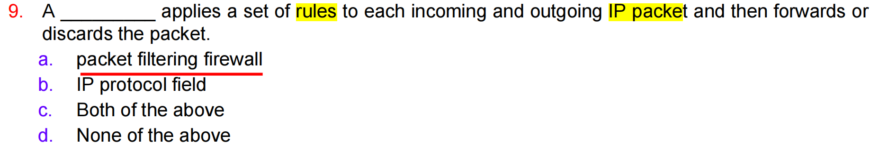
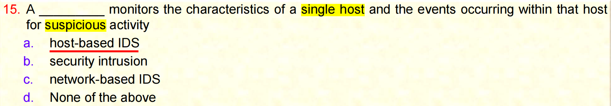

# Sample-Quiz 5

# 1

TLS 中最复杂的部分是签名 mage 消息 标头有效载荷握手我们已经讨论过握手协议是 TLS 中最复杂的 部分 TLS SSL 完全相同的东西所以如果我放 TLS 或放 SSL 我们指的是同一件事 所以这个问题可以用不同的方式重述但不完全是它所以如果你记住 它哦样本测验五个问题一个正确答案是 D 而你得到这个问题并且只是 盲目地放 D 它肯定不会是 D 它将被重新表述以不同的方式放入 不同但相同的主题相同的东西我不能带来知道来自其他星球的问题问题将 在同一主题上相似的水平所以如果你能够在理解的情况下做这些测验那么你 在真正的测验中不会有问题

# 2

某些东西是一个列表，其中包含客户端支持的加密算法组合， 好的，所以是包含加密算法组合的我们在 谈论很多很多算法，所以那不是压缩方法不是会话ID密码套件 是包含算法列表的那个，所以我们谈论加密算法，所以 协议中的密码套件是包含加密算法列表的那个

# 3

SSL记录协议为SSL提供两种服务连接消息完整性，SSL不 提供可用性不验证是机密性所以协议记录 协议提供消息完整性和机密性它 与可用性和身份验证无关SSL实际上不会验证客户端只 验证服务器但那只验证通过数字签名， 数字证书，而不是该协议

# 4

该东西用于向 纯实体传达与 SS 相关的警报现在已经回答了，要传达与 SS 相关的 警报，所以必须是警报协议，因为它正在传达警报，所以这是 用于传达 SS lat 警报的警报协议，因此如果您仔细阅读问题，您会看到答案 已经存在，所以是在谈论警报，所以不是数字签名，与数字证书无关， 警报也是如此

# 5

大多数浏览器都配备了TLS SSL 并且大多数 Web 服务器都实现了 此协议，这是真的我们今天使用的所有浏览器都已内置 SSL TLS SSL TLS 同样的东西所以他们已经内置了这就是为什么我们可以使用 https 所以答案是正确的

# 6

防火墙 可能是一个计算机系统是一组两个或多个系统，它们协作执行 防火墙功能所以我们知道这是真的可能是单台计算机或更多可能是硬件可能 是软件我们看一下架构我们如何组合数据包 过滤和两个专用 防火墙与屏幕子网一起提供，所以这就是正确的

# 7

为什么传统的数据包过滤 对单个数据包做出过滤决定，而不考虑任何更高 级别的上下文，这是正确的，因为单数据包过滤一次只查看一个数据包， 不查看 TCP 或上下文中的任何其他层，所以不查看上下文，不查看 第一个数据包还是最后一个数据包，中间数据包，它会一次查看每个单独的数据包， 这就是传统的数据包过滤 SPI当然会查看上下文，但传统的 数据包过滤一次只查看一个数据包，

# 8

在场所网络和互联网之间插入一些东西来建立控制链路并建立外部安全墙 或周边来保护场所网络免受基于互联网的 ATT 文本的侵害，是防火墙 会话 ID IP 当然介于两者之间，所以防火墙不能是会话 ID，会话 ID 与 SSL 有关，所以在这里我们正在查看周边并保护网络，所以这 是一个防火墙

# 9

一个向上的东西应用了一组规则适用于每个传入和传出的 IP 数据包， 然后转发并再次丢弃该数据包，这是一种数据包过滤防火墙，因为它会查看 数据包并查看 IP 地址，然后决定是否应该允许它 或应该阻止它，所以这是一个数据包过滤防火墙

# 10

入侵者入侵者 从外部传输数据包，其源 IP地址字段包含内部 主机的地址，称为 IP 地址，所以现在试图伪造 IP 地址当我们伪造 IP 地址时，这被称为欺骗，对吗？对吗？没有什么可以认证的，没有什么可以生成的， 所以它基本上是试图将 IP 地址变为内部的，所以它是欺骗所以它是伪造的， 使用假的 IP 地址，所以这被称为欺骗

# 11

某种防火墙控制 一侧的个人计算机或工作站与另一侧的互联网或企业网络之间的流量 现在代理服务器在这里是个人计算机，所以这是一个个人防火墙你 没有个人计算机的代理服务器对吗？对于个人计算机我们使用 个人 防火墙，所以它被称为个人防火墙

应用网关代理服务器用于 网络大型网络，所以我们谈论的是个人电脑我们有防火墙它们 是软件防火墙他们称之为个人防火墙所以这就是为什么个人防火墙 安装在个人电脑或工作站

# 12

防火墙上可以防止绕过 防火墙的攻击

如果攻击者足够聪明可以绕过防火墙

防火墙可以提供 保护

当然不绕过意味着我们在覆盖它所以这是错误的

不能所以攻击 绕过防火墙那么防火墙不能保护我们因为我们绕过它

# 13

直觉检测 基于这样的假设入侵者的行为与合法 用户的行为有所不同可以量化这是真的没有它我们不能这就是 基于动物的直觉检测的问题因为我们假设什么是正常的什么是不正常的所以这 就是为什么入侵者的行为我们怎么知道入侵者是真正的用户是这种 行为也许他们 没有用户 ID 密码也许他们的行为不正常 所以这就是 为什么我们可以区分正常和不正常的

# 14

基于签名的方法尝试 定义正常的我们预期的行为而异常方法尝试定义正确的行为 

基于签名没有定义行为基于签名有一个固定的攻击签名它会检查 匹配与否所以只有基于的才会这样所以这就是为什么这是错误的因为我们正在谈论 签名所以这个说法是错误的因为基于签名的方法无法定义什么是 正常的或不正常的基于签名就像防病毒我们有数据库其中所有的攻击 签名已经存在所以基于此我们会知道是否有采取这 与行为无关只有基于动物的会告诉我们它是否正常 基于行为所以这就是为什么这是错误的

# 15

原因某些东西监视 单个主机的特征以及该主机内发生的事件是否存在可疑活动

我们不是在 谈论安全直觉这个基于网络的不是单台计算机所以只有基于主机 ID 

因为基于主机的 ID 正在查看此单个主机

# 16

某些东西会监视 特定网段或设备的网络流量，并分析网络传输和 应用程序协议以识别可疑活动现在我们正在查看 网络流量主机 Bas ID 不会执行任何操作以确保信息安全，所以它是 基于网络的 ID，它监视所有内容，因此网络流量被分段 并通过基于网络的 ID，并且它会检查是否存在 查看不同的协议以查看是否有直觉，因为这里 我们正在查看整个网络而不是单个主机

# 17

某些东西涉及尝试定义 一组规则或攻击模式，可主机某些东西涉及尝试定义 一组规则或攻击模式，可用于决定给定行为是否为 入侵者基于配置文件的检测配置文件没有配置文件是你的 名字男女所以与它无关基于签名的与 它无关阈值检测与nml 检测无关这就是将检查 行为是否正常的

# 18

东西涉及数据收集 与 合法用户在一段时间内的行为有关，因此涉及收集与 合法用户行为有关的数据，提供签名阈值异常 再次异常，因为我们正在查看上一次的行为

