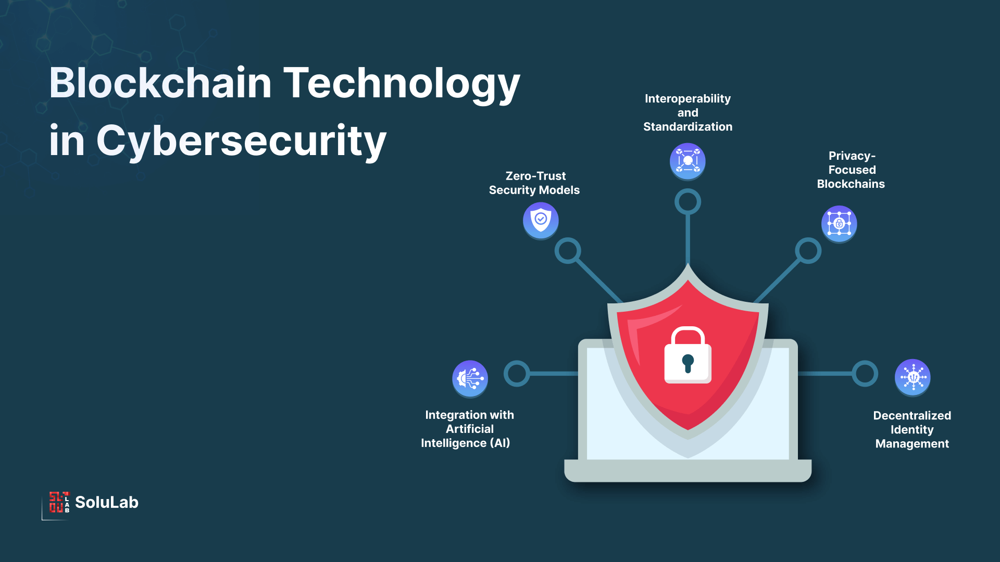

# EE6102 Cyber Security and Blockchain Technology

# 1.Introduction

The rapid advancement of **Industry 4.0** has brought significant benefits to society but has also increased the risks of cyber threats. This course aims to equip students with essential knowledge and skills in **cyber security and blockchain technology**, which are crucial for securing digital infrastructures and transactions in the modern world.

### What You’ll Find Here:

- **Personal Solutions to Past Exams** – Step-by-step solutions to previous exam questions to aid your understanding and preparation.
- **Lecture PPT Example References** – Detailed walkthroughs of key examples and exercises presented in lecture slides.
- **Analysis of Challenging Topics** – In-depth explanations of complex concepts to help you navigate difficult areas with ease.

If you find this repository useful, please consider **starring⭐ it on GitHub** to show your support!



# 2. **Course Outline**

The **industry 4.0** offers massive benefits to society but also provides opportunities to cyber attackers. 

Thus, the purpose of the first part of the course is to provide MSc students with the basic concepts of **cyber security**, and the necessary skills so that they can design cyber security **policies and deploy** appropriate technology to protect cyber space. 

**Blockchain** allows transactions of any kind to be simultaneously **anonymous and secure**. 

Thus, the aim of the second part of the course is to explain the basic concepts of Blockchain, its development, the potential business applications and how it can transform the world during Industry 4.0 revolution. 

This course is suitable for students studying MSc degree. Due to industry 4.0 and digital transformation, currently there is huge demands for jobs in this area and this demand will continue to increase as most industries will have to adopt industry 4.0 in order to remain competitive.


# 3.**Course Content**

Cyber Security Threat Landscape, 

Industry 4.0 and Cyber Security, 

Cyber Security Education, 

Awareness and Compliance, 

Cyber Security Planning, 

Policies and Compliance, 

Cyber Security Risk 

Assessments and Biometric-based Security approaches, 

Public key Infrastructure (PKI), 

Web Security 

and role of firewalls and Intrusion Detection, Online Payment, and Cryptocurrencies. 

Basics of Blockchain technology, 

Types of blockchain Technology, 

Blockchain Technology Applications for Industry 4.0, 

use cases and real-world case studies

# 4.**Reading and References**

Textbook:

(1) Stallings William, “Cryptography and Network Security: Principles and Practice”, 8th Edition, Pearson/Prentice- Hall, 2020. 

References: 

(1) Sudeep Tanwar,” Blockchain Technology: From Theory to Practice”, Springer, 2022. 

(2) Ralph Moseley “Advanced Cybersecurity Technologies”, CRS Press, December 2021.


# 5.Content


# 6.List of GitHub

`````
├─1.Exam
│      .keep
│      
├─2.PPT Example
│      1.2.2.3.1密码破解需要多长时间-1.pdf
│      1.2.2.3.2密码破解需要多长时间-2.pdf
│      1.2.2.6.4需要多少个包-1.pdf
│      1.2.2.6.4需要多少个包-2.pdf
│      1.2.2.6.4需要多少个包-3.pdf
│      Sample Quiz1.pdf
│      
├─3.Understand
│      .keep
│      
├─4.Resource
│  ├─1.OUTLINE
│  │      EE6102_OBTL (Abridge).pdf
│  │      
│  ├─2.Textbook
│  │      Cryptography and Network Security Principles and Practice, Global Edition, 8th (William Stallings) (Z-Library).pdf
│  │      
│  └─3.References
│          Advanced Cybersecurity Technologies (Ralph Moseley) (Z-Library).pdf
│          Blockchain Technology From Theory to Practice (Sudeep Tanwar) (Z-Library).pdf
│          
└─README.assets
        Blockchain-Technology-in-Cybersecurity.png

`````

# 7.Disclaimer

All content in this  is based solely on the contributors' personal work, Internet data.
All tips are for reference only and are not guaranteed to be 100% correct.
If you have any questions, please submit an Issue or PR.
In addition, if it infringes your copyright, please contact us to delete it, thank you.


#### Copyright © School of Electrical & Electronic Engineering, Nanyang Technological University. All rights reserved.
